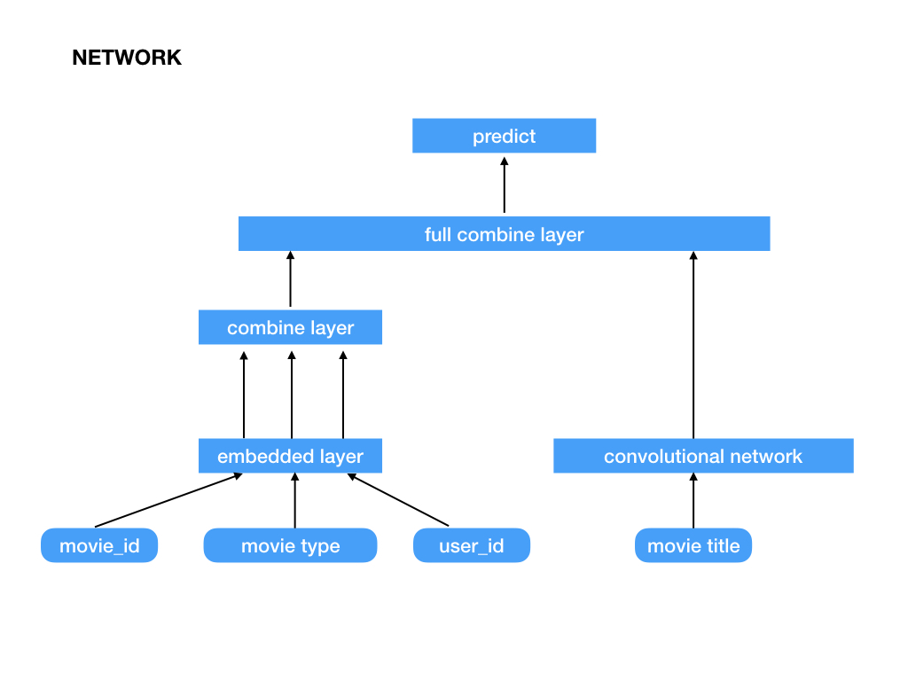

<!-- GFM-TOC -->
* [MovieRecommendation](#movieRecommendation)
    * [Introduction](#introduction)
    * [PartI](#partI)
    * [PartII](#partII)
    * [PartIII](#partIII)    
    * [Conclusion](#conclusion)  
    * [References](#references)  
    
# MovieRecommendation
## Introduction
* Design and implement the Movie Recommendation System based on MovieLens Datasets, and evaluate the accuracy and efficiency of our recommendation model
* Analyze the dataset of movie comments by using NLP methods, and exact useful comment keywords for a specific movie
* According to the NLP result, we will generate the subjective tags for every movie, like "good", "boring", "suck" and so on, which will help clients to find their interests
## PartI
### NLP for Movie comments
* Select the most frequency words in the comments
## PartII
### Collaborative Filtering
* Collaborative filtering is a method of making automatic predictions (filtering) about the interests of a user by collecting preferences or taste information from many users (collaborating).
* What we should do to use Collaborative Filtering Algorithm?
  * We should make data cleansing
  * We should converse the datas
  * We should generate the basic matrix for counting the interactions between users and items
  * We should calculate the similarity of users or items, then generate similaritry matrix
  * According to the similarity of matrix, we can generate the final recommendation lists
## PartIII
### Tensorflow Movie Recommendation
#### Network

#### Text Convolutional Network
The first layer of the network is the word embedding layer, an embedding matrix consisting of the embedded vectors of each word. The next layer uses a number of different size (window size) convolution kernels to convolve on the embedded matrix. The window size refers to each convolution covering several words. This is not the same as convolving the image. The convolution of the image is usually 2x2, 3x3, 5x5, and the text convolution is to cover the embedded vector of the entire word, so the size is (number of words, vector dimension). For example, slide 3, 4 or 5 words at a time. The third layer network is max pooling to get a long vector, and finally use dropout for regularization, and finally get the characteristics of the movie Title.
## Conclusion
### Difference between part1 and part2
**Collaborative Filtering using data of multiple users, Convolutional Network only use the user's own data**
## References
### Dataset
* [MovieLens](https://grouplens.org/datasets/movielens/)
### Other
* [Various Implementations of Collaborative Filtering](https://towardsdatascience.com/various-implementations-of-collaborative-filtering-100385c6dfe0)
* [Tensorflow Training](http://wiki.jikexueyuan.com/project/tensorflow-zh/tutorials/mnist_tf.html)
* [Tensorflow Offical](https://www.tensorflow.org/guide/low_level_intro)
* [Convolutional Neural Networks](https://medium.com/machine-learning-world/convolutional-neural-networks-for-all-part-ii-b4cb41d424fd)
* [Movie Recommendation](https://github.com/topics/movie-recommendation)
* [Deep Learning for Recommendations](https://blog.csdn.net/jackmcgradylee/article/details/79129105)
* [Machine Learning for Recommender systems](https://medium.com/recombee-blog/machine-learning-for-recommender-systems-part-1-algorithms-evaluation-and-cold-start-6f696683d0ed)
* [Recommender Systems](http://www.ritchieng.com/machine-learning-recommender-systems/)
